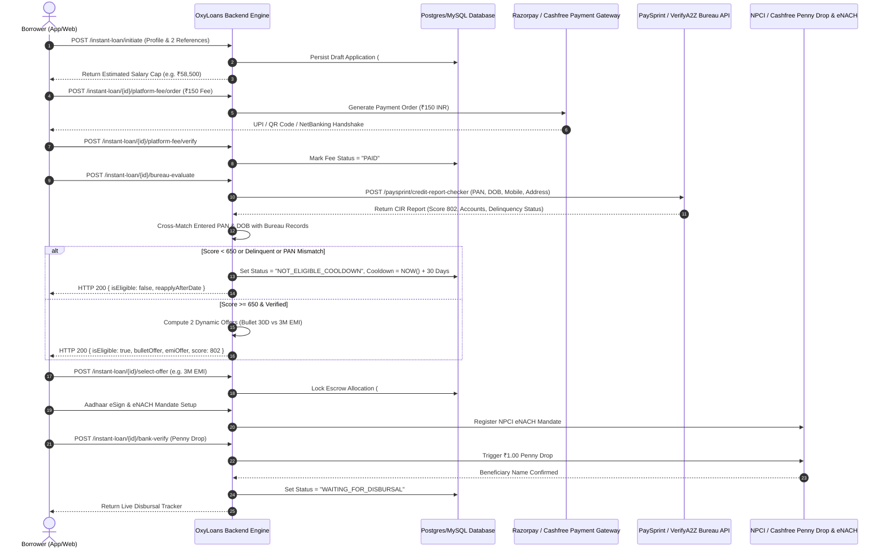

# Instant P2P Loan Journey - Backend Architecture & API Specifications
**Document Version:** 1.0.0  
**Target Backend Team & Code Agents**  
**Associated Frontend Flow:** `/borrower/instant-loan/:id` (Reference Application ID: `#41682`)  
**Base API Endpoint:** `https://fintech.oxyloans.com/oxyloans/v1/user/`

---

## 1. Executive Summary & Flow Lifecycle

This specification details the backend APIs, underwriting state machine, database models, and external gateway integrations required to power the production-grade **Instant Pre-Approved P2P Borrower Loan Journey**.



---

## 2. API Catalog & Endpoints

### 2.1 Initiate Instant Loan & Save Emergency References
* **Method:** `POST`
* **URL:** `/oxyloans/v1/user/instant-loan/initiate`
* **Headers:**
  ```http
  Authorization: Bearer {{accessToken}}
  Content-Type: application/json
  ```
* **Request Payload:**
  ```json
  {
    "userId": 41682,
    "name": "narendra kumar b",
    "mobile": "9492902990",
    "panNumber": "CDBPB2737H",
    "dateOfBirth": "1994-08-08",
    "motherName": "abc",
    "maritalStatus": "Married",
    "spouseName": "Non",
    "spouseDob": "2003-10-20",
    "monthlySalary": 65000,
    "employmentType": "SALARIED",
    "companyName": "SRS Fintech Labs Pvt Ltd",
    "designation": "Senior Software Engineer",
    "officeAddress": "oxyloans",
    "officeMailId": "nanan@gmail.com",
    "officeLandLine": "12254655",
    "address": "KPHB, Hyderabad",
    "pincode": "500072",
    "references": [
      {
        "name": "Balijepalli Venkata",
        "mobile": "9848022338",
        "relation": "Parent"
      },
      {
        "name": "Kiran Sharma",
        "mobile": "9121234567",
        "relation": "Colleague"
      }
    ]
  }
  ```
* **Response (200 OK):**
  ```json
  {
    "success": true,
    "applicationId": "41682",
    "status": "INITIATED",
    "estimatedEligibilityCap": 58500,
    "platformFeeRequired": 150.00,
    "message": "Instant loan application drafted and references recorded."
  }
  ```

---

### 2.2 Create Platform Assessment Fee Order (₹150 INR)
* **Method:** `POST`
* **URL:** `/oxyloans/v1/user/instant-loan/{applicationId}/platform-fee/order`
* **Headers:**
  ```http
  Authorization: Bearer {{accessToken}}
  Content-Type: application/json
  ```
* **Response (200 OK):**
  ```json
  {
    "success": true,
    "orderId": "order_OXYFEE_1928392",
    "amount": 150.00,
    "currency": "INR",
    "taxBreakup": {
      "baseAmount": 127.12,
      "gstAmount": 22.88,
      "gstPercentage": 18
    },
    "upiIntentUrl": "upi://pay?pa=oxyloans@icici&pn=OxyLoans&am=150.00&cu=INR&tn=Fee_41682"
  }
  ```

---

### 2.3 Verify Platform Fee Payment
* **Method:** `POST`
* **URL:** `/oxyloans/v1/user/instant-loan/{applicationId}/platform-fee/verify`
* **Request Payload:**
  ```json
  {
    "orderId": "order_OXYFEE_1928392",
    "paymentId": "pay_982934892",
    "signature": "e93849fbc92384a...",
    "paymentMethod": "UPI_APP"
  }
  ```
* **Response (200 OK):**
  ```json
  {
    "success": true,
    "applicationId": "41682",
    "feePaid": true,
    "paidAt": "2026-10-02T14:15:00Z",
    "message": "Platform assessment fee verified. Ready for bureau evaluation."
  }
  ```

---

### 2.4 Credit Bureau Underwriting & PAN/DOB Verification
* **Method:** `POST`
* **URL:** `/oxyloans/v1/user/instant-loan/{applicationId}/bureau-evaluate`
* **Business Logic:**
  1. Calls existing PaySprint endpoint `/paysprint/credit-report-checker`.
  2. Compares input `panNumber` with Bureau `personalInfo.identityInfo.pANId[0].idNumber`.
  3. Compares input `dateOfBirth` with Bureau `personalInfo.dateOfBirth`.
  4. Checks Bureau Score (from `scoreDetails[0].value`).
  5. Computes eligibility and dynamic offers.
* **Success Response (Eligible, Score 802):**
  ```json
  {
    "success": true,
    "applicationId": "41682",
    "isEligible": true,
    "score": 802,
    "scoreRating": "Prime+",
    "verificationChecks": {
      "panMatched": true,
      "dobMatched": true,
      "writeOffCount": 0,
      "pastDueAmount": 0.00,
      "activeAccountsCount": 1
    },
    "offers": {
      "bulletOffer": {
        "id": "OFFER_BULLET_30D",
        "type": "BULLET",
        "principal": 30000,
        "tenureDays": 30,
        "roi": 16.5,
        "interest": 412,
        "processingFee": 600,
        "gst": 108,
        "netDisbursal": 29292,
        "totalPayable": 30412
      },
      "emiOffer": {
        "id": "OFFER_EMI_3M",
        "type": "EMI",
        "principal": 45000,
        "tenureMonths": 3,
        "roi": 18.0,
        "emiPerMonth": 15453,
        "totalInterest": 1359,
        "processingFee": 1125,
        "gst": 202,
        "netDisbursal": 43672,
        "totalPayable": 46359,
        "schedule": [
          { "installmentNo": 1, "amount": 15453, "dueDate": "2026-11-02" },
          { "installmentNo": 2, "amount": 15453, "dueDate": "2026-12-02" },
          { "installmentNo": 3, "amount": 15453, "dueDate": "2027-01-02" }
        ]
      }
    }
  }
  ```
* **Not Eligible Response (Score < 650 or Delinquency or PAN Mismatch):**
  ```json
  {
    "success": true,
    "applicationId": "41682",
    "isEligible": false,
    "cooldownDays": 30,
    "reapplyAfterDate": "2026-11-01",
    "rejectionReasons": [
      "Credit bureau score does not meet prime underwriting threshold (650+)",
      "High aggregate revolving credit card exposure (> 80%)"
    ]
  }
  ```

---

### 2.5 Select Loan Offer & Lock Escrow Allocation
* **Method:** `POST`
* **URL:** `/oxyloans/v1/user/instant-loan/{applicationId}/select-offer`
* **Request Payload:**
  ```json
  {
    "offerId": "OFFER_EMI_3M",
    "selectedTenure": 3,
    "principal": 45000
  }
  ```
* **Response (200 OK):**
  ```json
  {
    "success": true,
    "applicationId": "41682",
    "selectedOfferId": "OFFER_EMI_3M",
    "matchedLender": "OxyLoans Escrow Institutional Lending Pool #41682",
    "status": "AWAITING_ESIGN_AND_ENACH",
    "kfsDocumentUrl": "https://fintech.oxyloans.com/oxyloans/v1/user/41682/kfs.pdf"
  }
  ```

---

### 2.6 Bank Account Penny Drop Verification
* **Method:** `POST`
* **URL:** `/oxyloans/v1/user/instant-loan/{applicationId}/bank-verify`
* **Request Payload:**
  ```json
  {
    "accountHolderName": "BALIJEPALLI NARENDRA",
    "bankName": "State Bank of India",
    "accountNumber": "02529657461119",
    "ifscCode": "SBIN0005220",
    "accountType": "SAVINGS"
  }
  ```
* **Response (200 OK):**
  ```json
  {
    "success": true,
    "verified": true,
    "pennyDropStatus": "SUCCESS",
    "beneficiaryNameAtBank": "BALIJEPALLI NARENDRA",
    "nameMatchScore": 100,
    "status": "WAITING_FOR_DISBURSAL",
    "message": "Bank account verified. Loan queued for escrow disbursal."
  }
  ```

---

### 2.7 Get Live Disbursal Tracker & Timeline
* **Method:** `GET`
* **URL:** `/oxyloans/v1/user/instant-loan/{applicationId}/status`
* **Response (200 OK):**
  ```json
  {
    "success": true,
    "applicationId": "41682",
    "status": "WAITING_FOR_DISBURSAL",
    "sanctionedPrincipal": 45000.00,
    "netDisbursalAmount": 43672.00,
    "disbursalBank": {
      "bankName": "State Bank of India",
      "accountNumberMasked": "•••• •••• 1119",
      "ifscCode": "SBIN0005220"
    },
    "matchedEscrowPool": "OxyLoans Escrow Pool #41682",
    "estimatedDisbursalTime": "2026-10-02T16:00:00Z",
    "milestones": [
      { "name": "Profile & References", "completed": true, "timestamp": "2026-10-02T14:10:00Z" },
      { "name": "Platform Fee Paid (₹150)", "completed": true, "timestamp": "2026-10-02T14:12:00Z" },
      { "name": "Bureau Score Verified (802)", "completed": true, "timestamp": "2026-10-02T14:13:00Z" },
      { "name": "Loan Offer Accepted", "completed": true, "timestamp": "2026-10-02T14:14:00Z" },
      { "name": "Aadhaar eSign & eNACH Active", "completed": true, "timestamp": "2026-10-02T14:15:00Z" },
      { "name": "Bank Penny Drop Verified", "completed": true, "timestamp": "2026-10-02T14:16:00Z" },
      { "name": "Escrow Disbursal in Flight", "completed": false, "inProgress": true }
    ]
  }
  ```

---

## 3. Database Schema Recommendations

```sql
-- 1. Main Instant Loan Applications
CREATE TABLE instant_loan_applications (
    id BIGSERIAL PRIMARY KEY,
    application_id VARCHAR(50) UNIQUE NOT NULL, -- e.g. '41682'
    user_id BIGINT NOT NULL,
    monthly_salary NUMERIC(12, 2) NOT NULL,
    company_name VARCHAR(255),
    employment_type VARCHAR(50) DEFAULT 'SALARIED',
    designation VARCHAR(100),
    office_address TEXT,
    office_mail_id VARCHAR(100),
    office_landline VARCHAR(30),
    mother_name VARCHAR(100),
    marital_status VARCHAR(30) DEFAULT 'Married',
    spouse_name VARCHAR(100),
    spouse_dob VARCHAR(30),
    pan_number VARCHAR(10) NOT NULL,
    date_of_birth DATE NOT NULL,
    platform_fee_paid BOOLEAN DEFAULT FALSE,
    platform_fee_payment_id VARCHAR(100),
    bureau_score INT,
    bureau_pan_matched BOOLEAN DEFAULT FALSE,
    bureau_dob_matched BOOLEAN DEFAULT FALSE,
    underwriting_status VARCHAR(50) DEFAULT 'DRAFT', -- 'ELIGIBLE', 'NOT_ELIGIBLE_COOLDOWN', 'OFFER_ACCEPTED', 'WAITING_FOR_DISBURSAL', 'DISBURSED'
    cooldown_until TIMESTAMP,
    selected_offer_type VARCHAR(20), -- 'BULLET', 'EMI'
    sanctioned_amount NUMERIC(12, 2),
    net_disbursal_amount NUMERIC(12, 2),
    roi NUMERIC(5, 2),
    tenure INT,
    esign_status VARCHAR(30) DEFAULT 'PENDING',
    enach_status VARCHAR(30) DEFAULT 'PENDING',
    bank_account_verified BOOLEAN DEFAULT FALSE,
    disbursal_utr VARCHAR(100),
    created_at TIMESTAMP DEFAULT CURRENT_TIMESTAMP,
    updated_at TIMESTAMP DEFAULT CURRENT_TIMESTAMP
);

-- 2. Emergency References Table (Minimum 2 required)
CREATE TABLE instant_loan_references (
    id BIGSERIAL PRIMARY KEY,
    application_id VARCHAR(50) REFERENCES instant_loan_applications(application_id),
    name VARCHAR(255) NOT NULL,
    mobile VARCHAR(15) NOT NULL,
    relationship VARCHAR(50) NOT NULL,
    verified BOOLEAN DEFAULT TRUE,
    created_at TIMESTAMP DEFAULT CURRENT_TIMESTAMP
);

-- 3. Platform Fee Transactions
CREATE TABLE instant_loan_fee_transactions (
    id BIGSERIAL PRIMARY KEY,
    application_id VARCHAR(50) REFERENCES instant_loan_applications(application_id),
    order_id VARCHAR(100) NOT NULL,
    payment_id VARCHAR(100),
    amount NUMERIC(8, 2) DEFAULT 150.00,
    base_fee NUMERIC(8, 2) DEFAULT 127.12,
    gst_fee NUMERIC(8, 2) DEFAULT 22.88,
    payment_method VARCHAR(50),
    status VARCHAR(30) DEFAULT 'SUCCESS',
    created_at TIMESTAMP DEFAULT CURRENT_TIMESTAMP
);
```

---

## 4. Underwriting & Business Logic Constants

| Parameter | Formula / Threshold | Description |
|---|---|---|
| **Platform Fee** | ₹150 INR (Flat) | ₹127.12 Base + 18% GST (₹22.88) |
| **Max Eligibility Cap** | `Salary * 0.90` (Min ₹15,000, Max ₹2,00,000) | Instant borrowing cap |
| **Prime+ Bureau Score** | `>= 750` | Unlocks 16.5% – 18.0% p.a. ROI |
| **Standard Bureau Score** | `680 – 749` | 19.5% – 24.0% p.a. ROI |
| **Subprime / Cooldown** | `< 650` | Triggers **30-Day Reapply Cooldown** |
| **Reducing Balance Formula** | `EMI = P * r * (1+r)^n / ((1+r)^n - 1)` | Standard Indian banking reducing balance formula |
| **Bullet Loan Interest** | `Interest = P * (annualRoi / 12 / 100)` | 30-day single bullet repayment calculation |
| **Processing Fee** | 2.0% – 2.5% of Principal + 18% GST | Deducted upfront from net disbursal |

---

## 5. Instructions for Backend Developer / Code Agent
1. **Repository Target:** Backend Spring Boot / Microservices repo.
2. **Reuse Existing Bureau Module:** Use the existing PaySprint client module currently handling `/paysprint/credit-report-checker`.
3. **Escrow Integration:** Wire the final status (`WAITING_FOR_DISBURSAL`) to the existing OxyLoans Escrow Disbursal Scheduler to generate payout batch files.
